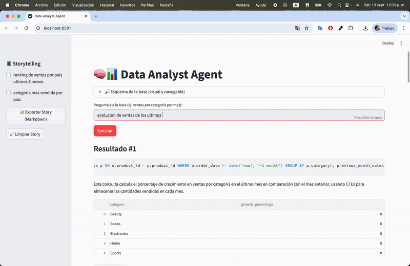

# 🧠📊 Guzzito Analyst — Data Analyst Agent

**Mini-app** de análisis de datos en lenguaje natural con:
- **SQLite** local (toy DB con `customers`, `products`, `orders`)
- **Agente** que planifica → genera **SQL** → valida → ejecuta → **explica**
- **Gráficos automáticos** y tabla exportable a **CSV**
- **UI en Streamlit** con **historial persistente** + **Storytelling** (selección y export a Markdown)
- **Esquema visual** (diagrama ER interactivo + previews)

---

## ✨ Demo (qué hace)



- “ventas por categoría por mes” → genera SQL + gráfico de líneas  
- “top 10 productos por revenue” → ranking con barras  
- “evolución mensual AR vs MX” → serie por país  
- “clientes con mayor ticket promedio” → tabla + CSV  

> La UI mantiene **historial**, podés **marcar** tarjetas y **exportar Story.md** con la narrativa (pregunta, SQL y explicación).

---

## 🗂️ Estructura
```bash
├─ agent_core.py # LLM orchestration + charts
├─ tools_sql.py # DB utils + validación segura de SQL
├─ seed_db.py # genera toy.db con datos sintéticos
├─ ui_streamlit.py # interfaz Streamlit (historial + storytelling)
├─ sample_prompts/
│ └─ system_sql_analyst.md # prompt del analista SQL
├─ .session/ # historial persistido por sesión
├─ requirements.txt
├─ .env.example
└─ .gitignore
```

---

## ⚙️ Requisitos

- Python **3.10+**  
- macOS / Linux / Windows  
- Clave de API de OpenAI  

---

## 🚀 Instalación rápida

```bash
git clone https://github.com/<tu-usuario>/guzzito-analyst.git
cd guzzito-analyst

python3 -m venv .venv
source .venv/bin/activate   # Windows: .venv\Scripts\activate

pip install -r requirements.txt

cp .env.example .env   # completar OPENAI_API_KEY
python seed_db.py

streamlit run ui_streamlit.py
```

---

## 🔒 Guardrails de SQL

- Solo lectura (`SELECT`, `WITH`, `UNION`, etc.)  
- Se bloquean `INSERT`, `UPDATE`, `DELETE`, `DROP`, `ALTER`, etc.  
- `LIMIT` automático para evitar queries pesadas  
- Sanitización de comentarios y fences ```sql  

---

## 🧠 Memoria / Historial

- Cada ejecución guarda: pregunta, SQL, explicación, resultados  
- Persistencia en `./.session/<session_id>.json`  
- **Storytelling**: seleccionás tarjetas y exportás un **Markdown** con tu narrativa  

Acciones en sidebar:  
- 🧹 Limpiar Story → desmarca selección  
- 🗑️ Borrar historial de sesión → borra ejecuciones  
- 🆕 Nueva sesión → genera otro session_id  

---

## 🗺️ Esquema visual

- Diagrama ER con tablas y FKs (Graphviz)  
- Vista de columnas con row count  
- Preview de 5 filas por tabla  

---

## ✏️ Ejemplos de preguntas

- “ventas por categoría por mes”  
- “top 10 productos por revenue”  
- “evolución mensual AR vs MX”  
- “% de ventas por categoría en el último trimestre”  


---

## 🏗️ Arquitectura

1. **LLM**: recibe schema + contexto y devuelve JSON con `{sql, explain, viz_suggestion, notes}`  
2. **Validador**: limpia query, chequea AST, bloquea DML/DDL  
3. **Executor**: corre en SQLite local  
4. **Visualizer**: bar/line plot automático  
5. **Persistence**: guarda interacción en `.session/`  

---

## 📦 Dependencias clave
```bash
python-dotenv
openai
pandas
sqlglot
sqlite-utils
matplotlib
streamlit
```
---

## 🛠️ Troubleshooting

- **“Solo se permiten consultas SELECT”** → actualizá validador  
- **“module 'sqlglot.expressions' has no attribute 'Reindex'”** → actualizar `sqlglot`  
- **“no numeric data to plot”** → fix con coerción numérica  
- **“StreamlitDuplicateElementId”** → usar `key=` único en widgets  

---

## ☁️ Deploy

- **Streamlit Cloud** → conectar repo + secret `OPENAI_API_KEY`  
- **Hugging Face Spaces** → Streamlit + secrets  
- **Docker** (opcional):  

```dockerfile
FROM python:3.11-slim
WORKDIR /app
COPY requirements.txt .
RUN pip install -r requirements.txt
COPY . .
EXPOSE 8501
CMD ["streamlit", "run", "ui_streamlit.py", "--server.address=0.0.0.0"]
```

---

## 📄 Licencia

Este proyecto está bajo la licencia [MIT](LICENSE).
